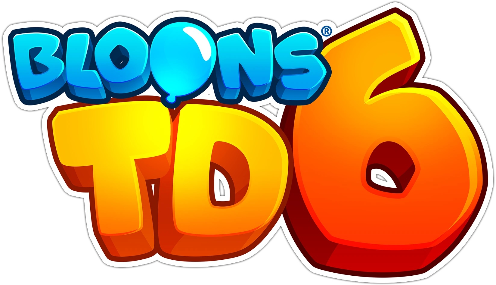

<!DOCTYPE html>
<html>
<body>

<h1 style="font-family:Lucida Handwriting;font-size:50px;" align="center"> </h1>

<h2 style="font-family:Arial;font-size:20px;">Exploring the Dynamics of "Bloons Tower Defense 6": A Comprehensive Analysis</h2>

Ninja Kiwi's "Bloons Tower Defence 6" (BTD6) is a significant addition to the tower defence genre. It was released in June 2018 and develops upon the firm bases set by its predecessors by combining interesting gameplay with an extensive level of strategy. This essay looks at the primary elements that contribute to making it successful, such as its aesthetic appeal, strategic depth, game mechanics, and community surrounding it.

<h3 style="font-family:Arial;font-size:20px;">Core Gameplay, Progression and Game Mechanics</h3>

Fundamentally, BTD6 has a straightforward notion: by carefully positioning towers that shoot or interact with waves of balloons, commonly referred to as "bloons," players can stop these balloons from reaching the end of a path. Its simplicity, however, hides the complex dynamics of the game. Because every tower has different capabilities and upgrade routes, there are dimensions to the strategic landscape and a big influence on how things turn out.

The game offers a variety of bloon types, each with unique attributes. For instance, camo bloons remain concealed only detectable by specialised towers, and lead bloons are impervious to ordinary attacks and necessitate a certain kind of tower to counter them. Because of this diversity, careful preparation and adaptation are required to keep players interested and challenged throughout the game.

The strategic depth of BTD6 makes it stand out. When constructing their defence strategy, players must take into account a lot of things, including where to put towers, what upgrades to choose, and how to combine different kinds of towers. There are several upgrade paths available for every type of tower in the game, providing highly customisable gameplay. The addition of hero characters, each with special skills that can change the course of a match, further deepens this aspect of the game.

Another layer to the strategy in BTD6 is the advancement system. New towers, upgrades, and game types become available to players as they go through the levels. Even once players have learned the fundamentals, the game will still be interesting to them since they can revisit levels with new obstacles and techniques, including "impoppable" or "deflation" modes.

<h4 style="font-family:Arial;font-size:20px;">Community Impact, Longevity, Visual and Auditory Appeal</h4>

The graphic design of BTD6 is lively and captivating. The graphics of the game are cartoony and vibrant, making it visually appealing and easily navigable. The imaginative tower and bloon designs create a playful ambience that contrasts with the strategic intricacy of the game. The gameplay is made both engaging and pleasant by the lively soundtrack and sound effects that enhance the whole experience in addition to the visual appeal.

BTD6 gave rise to an established and passionate community. The way the game is made encourages players to challenge one another, explore innovative concepts, and share strategies. Regular updates from Ninja Kiwi, which add new material and make balancing adjustments to keep the game interesting and current, support this community-building aspect. Players can interact, share their experiences, and contribute to the game's constant advancement on the game's forums and social media presence.

BTD6 has also received recognition for being inclusive and accessible. It may appeal to a broad range of players, from casual gamers to ardent strategists, thanks to its unique blend of simple action and strategic depth. The game's ongoing success and popularity can be credited in part to its wide appeal.
The peace of gameplay is further enhanced by the game's graphic style. Players can recognise threats and adjust their strategy with ease thanks to clear animations and unique bloon shapes. The user interface's straightforward design guarantees that players can quickly and simply command their defences.

<h6 style="font-family:Arial;font-size:20px;">Conclusion</h6>

"Bloons Tower Defense 6" exemplifies the strengths of the tower defense genre, combining engaging gameplay mechanics with strategic depth, appealing visuals, and a supportive community. Its ability to offer both immediate fun and long-term strategic challenges makes it a standout title in its field. By continuously evolving and engaging its player base, BTD6 has secured its place as a beloved game that continues to captivate and entertain.

To play download the game by clicking <a href="https://store.steampowered.com/app/960090/Bloons_TD_6/"style="color:#39FF14;">here.</a>

This is the loading screen for the game, with my account details cropped out.

</body>
</html>
